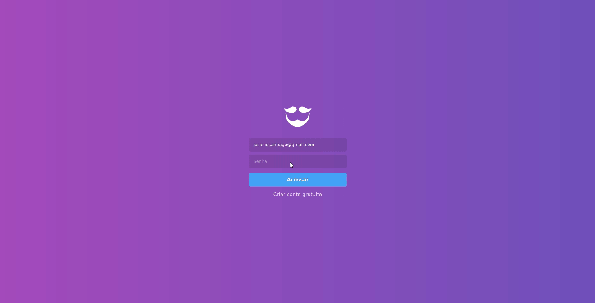

# GoBarber

A GoBarber é uma aplicação fictícia para o gerenciamento de agendamentos de uma barbearia. Essa aplicação faz parte do curso GoStack - Bootcamp da [Rocketseat](https://rocketseat.com.br/).




### **Para a execução do projeto é necessária a instalação do [GoBarber API](https://github.com/jozieliosantiago/gobarber-api)**

## Instalação

Após clonar o repositório, dentro da pasta criada, execute o comando:

```bash
yarn
```

## Execução

Dentro da pasta do projeto, execute:

```bash
yarn start
```

## Licença
[MIT](https://choosealicense.com/licenses/mit/)
